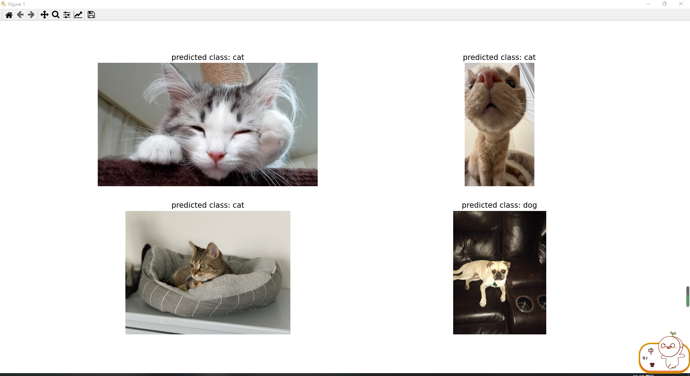

# Real-time-images-detection-and-hashtags-generation-for-tweets
In this project, we use Pyspark and Pytorch to build a stream processing pipeline to get images from Twitter API and do real time images detection and hashtags generation for tweets.

## Platform
We used GCP platform to train all models with NVIDIA Tesla V100.  
In order to combine Pyspark and Pytorch, we implmented our system on AWS with platform of Databricks. It provides a enviroment where we can run both Pyspark and Pytorch.

## Codes
### Model training
- `collect_images.ipynb` Collect images from Twitter API for semi-supervised learning.
- `train_model.ipynb` Train ResNet50
### Stream Processing
- `sender.ipynb` Create TCP connection, request images with specific hashtags from Twitter API.
- `spark_receiver.ipynb` Receive DStream from sender and process data to predict the label. At last, it will restore 4 images per window as one npy file for displaying.
- `display.ipynb` Display the result.  
You should run sender and spark_receiver first. Once they get images and start processing, you should run display. It can display images by reading npy files in the folder. **WARNING:** It will delete all npy files to do real time display. So if you wan to store all results, please do not run this code.

## Demo

## Implement details
Please check all implement details and analysis is [our report](https://github.com/cjdsj/Real-time-images-detection-and-hashtags-generation-for-tweets/blob/main/Project%20Report.pdf)
